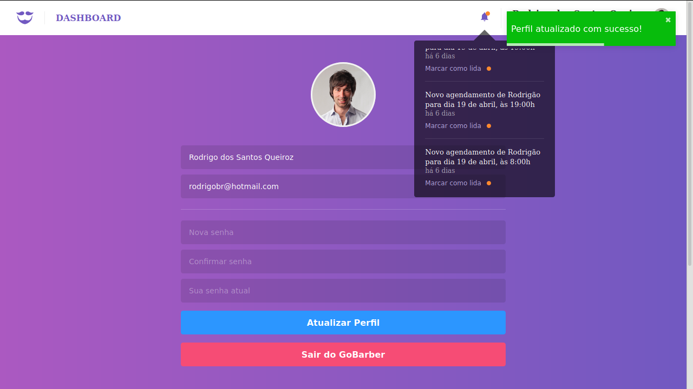

<h2 align="center">
  A barber scheduling app.
</h2>


<p align="center">
  <a href="#rocket-technologies">Technologies</a>&nbsp;&nbsp;&nbsp;|&nbsp;&nbsp;&nbsp;
  <a href="#information_source-how-to-use">How To Use</a>
</p>




## :rocket: Technologies

This project was developed at the [RocketSeat GoStack Bootcamp](https://rocketseat.com.br/bootcamp) with the following technologies:

-  [ReactJS](https://reactjs.org/)
-  [Create React App Configuration Override](https://github.com/sharegate/craco)
-  [Redux](https://redux.js.org/)
-  [Redux-Saga](https://redux-saga.js.org/)
-  [React Router](https://github.com/ReactTraining/react-router)
-  [styled-components](https://www.styled-components.com/)
-  [Axios](https://github.com/axios/axios)
-  [History](https://www.npmjs.com/package/history)
-  [Immer](https://github.com/immerjs/immer)
-  [Polished](https://polished.js.org/)
-  [React-Toastify](https://fkhadra.github.io/react-toastify/)
-  [React-Icons](http://react-icons.github.io/react-icons/)
-  [react-perfect-scrollbar](https://github.com/OpusCapita/react-perfect-scrollbar)
-  [Unform](https://github.com/Rocketseat/unform)
-  [Yup](https://www.npmjs.com/package/yup)
-  [date-fns](https://date-fns.org/)  
-  [Reactotron](https://infinite.red/reactotron)

## :information_source: How To Use

To clone and run this application, you'll need [Git](https://git-scm.com), [Node.js](nodejs) + [Yarn](https://yarnpkg.com/) installed on your computer and the [GoBarber API](https://github.com/rodrigo7331/go-barber-api). From your command line:

```bash
# Clone this repository
$ git clone https://github.com/rodrigo7331/go-barber-web

# Go into the repository
$ cd go-barber-web

# Install dependencies
$ yarn install

# Run the app
$ yarn start
```
